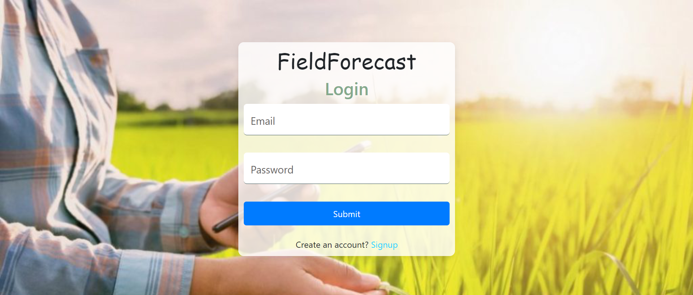
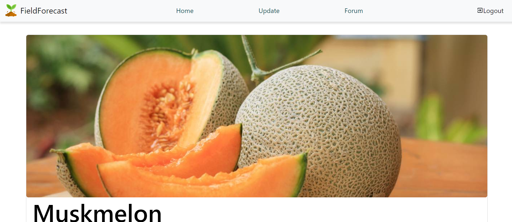
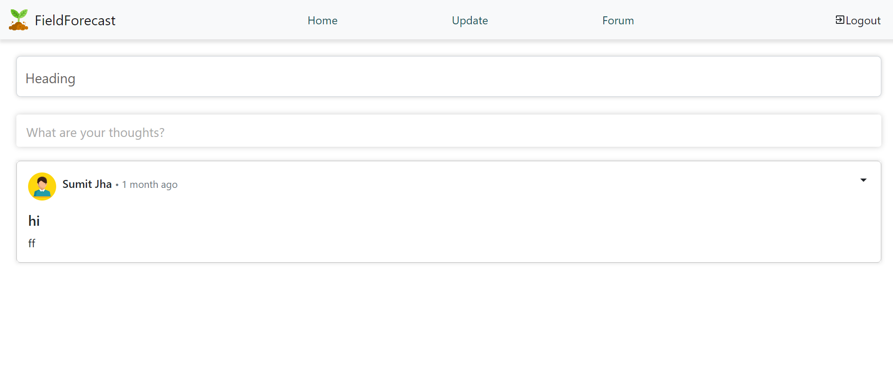
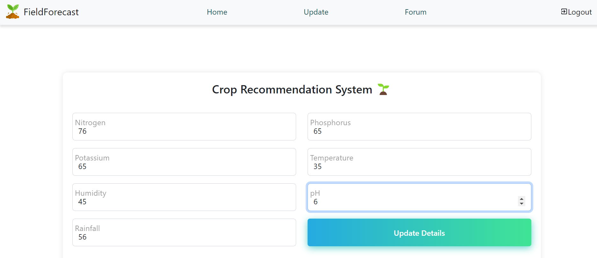
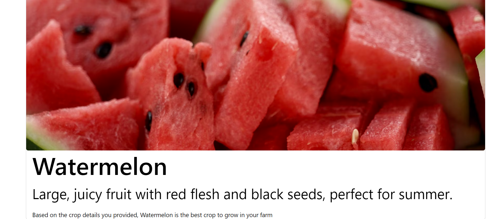
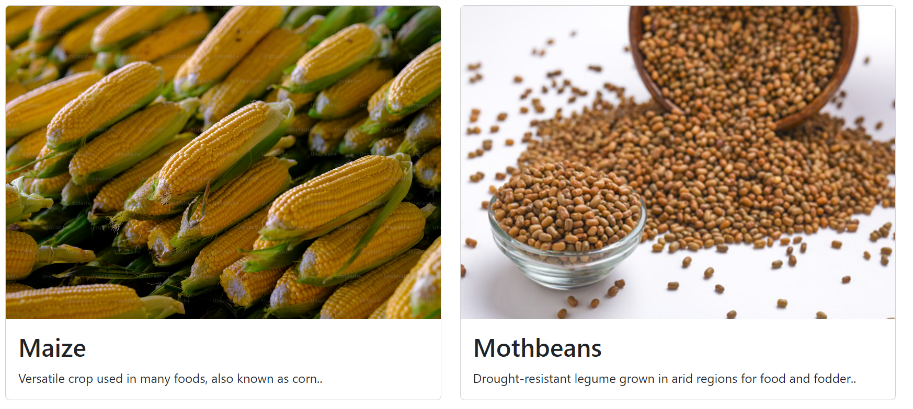

FieldForecast
FieldForecast is a comprehensive agricultural project aimed at revolutionizing farming practices by leveraging technology and data-driven insights. It consists of several components, including a React web application, a mobile application developed using React Native, a server-side MERN Stack backend, and an ensembled machine learning model for precise recommendations for crops based on soil parameters.

Features
Crop Recommendation: Utilizes machine learning algorithms to provide personalized crop recommendations based on soil and environmental data.
REST APIs: Single API calls support both the web and mobile applications.
Security: The application is secured with Bcrypt and JWT libraries to protect user data.
Community Forum: Facilitates knowledge sharing and collaboration among farmers through a dedicated forum.
User Authentication: Provides secure sign-up, login, and logout functionalities.
Technologies Used
MongoDB: NoSQL database used for storing user data, posts, and other information.
Express.js: Web application framework for building APIs and handling HTTP requests.
React.js: Frontend library for building user interfaces.
Node.js: JavaScript runtime environment for server-side logic.
Mongoose: MongoDB object modeling tool for Node.js.
React Native: UI software framework for developing mobile applications on Android and iOS platforms.
JWT (JSON Web Tokens): Used for user authentication and authorization.
Bcrypt: Used for encrypting user passwords.
Flask: Micro web framework written in Python, used to run the ML model and manage interactions with it.
Project Structure
The project is organized into the following folders:

App: Contains the code for the mobile application developed using Expo and React Native.
Server: Houses the backend server implementation using the MERN stack (MongoDB, Express.js, React.js, Node.js).
Client: Contains the code for the web application frontend, developed using React.js.
ML: Includes the machine learning module responsible for crop recommendation, implemented using Python.
How to Run
To run FieldForecast on your local machine, follow these steps:

1. Clone the Repository
bash
Copy code
git clone https://github.com/your-username/FieldForecast.git
cd FieldForecast
2. Install Dependencies
Server

bash
Copy code
cd server
npm install
Client

bash
Copy code
cd client
npm install
App

bash
Copy code
pip install numpy pandas sklearn requests pickle
3. Set Up MongoDB
Ensure you have MongoDB installed and running on your system. Update the MongoDB connection string in the server code if necessary.

4. Start the Servers
Server

bash
Copy code
cd server
npm start
Client

bash
Copy code
cd client
npm run dev
ML

bash
Copy code
cd ml
python app.py
5. Access the Application
Web App: Open your web browser and go to http://localhost:3000.

